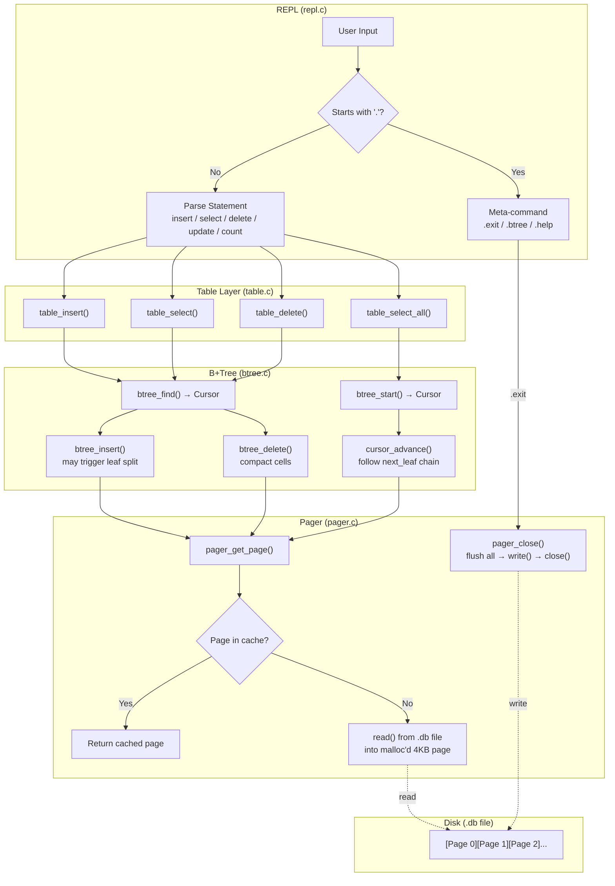
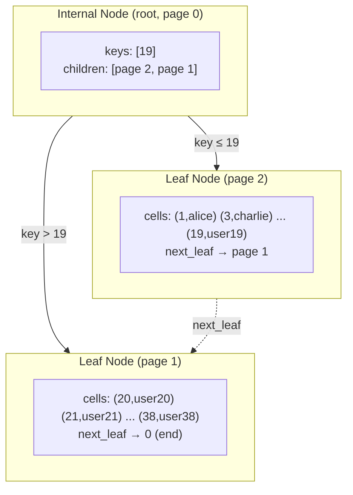
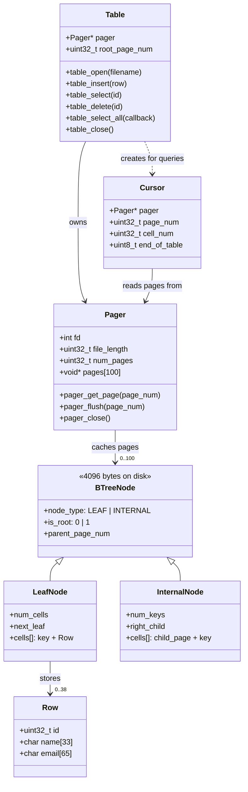

# vdb - A Mini Database in C

A lightweight, persistent key-value database built from scratch with a B+Tree index, page-based storage, and an interactive REPL. Stores data in a single `.db` file that survives restarts -- all without any external libraries.

## What It Does

vdb is a single-table database that supports:

- **Insert** rows with an integer key, name, and email
- **Select** a single row by id, or scan all rows (returned in sorted order)
- **Update** a row's name and email by id
- **Delete** a row by id
- **Count** total rows
- **Persistence** -- data is flushed to a `.db` file on exit and reloaded on restart
- **B+Tree visualization** -- inspect the internal tree structure with `.btree`

## Architecture



## How the B+Tree Works

The B+Tree is the core data structure. All rows are stored in **leaf nodes**, sorted by key. Internal nodes only store keys and child pointers for navigation.



- **Search** uses binary search at each level: O(log n)
- **Insert** finds the correct leaf, inserts in sorted position. If the leaf is full (38 cells), it **splits** into two leaves and pushes a key up to the parent
- **Scan** starts at the leftmost leaf and follows the `next_leaf` pointer chain
- **Delete** removes the cell and compacts the remaining cells left

## On-Disk Page Layout

Every page is exactly 4096 bytes. The `.db` file is an array of pages:

```
.db file:  [Page 0 (4096B)][Page 1 (4096B)][Page 2 (4096B)]...
```

### Leaf Node (stores actual rows)

```
Offset  Size   Field
──────  ─────  ──────────────────────────
0       1      node_type (1 = LEAF)
1       1      is_root
2       4      parent_page_num
6       4      num_cells
10      4      next_leaf (page num, 0 = none)
14      106    cell[0]: key (4B) + row (102B)
120     106    cell[1]
...
                max 38 cells per leaf
```

### Internal Node (routing only)

```
Offset  Size   Field
──────  ─────  ──────────────────────────
0       1      node_type (0 = INTERNAL)
1       1      is_root
2       4      parent_page_num
6       4      num_keys
10      4      right_child (page num)
14      8      cell[0]: child (4B) + key (4B)
22      8      cell[1]
...
                max 510 keys per internal node
```

### Row Format (102 bytes, packed)

```
Offset  Size   Field
──────  ─────  ─────
0       4      id       (uint32_t)
4       33     name     (32 chars + NUL)
37      65     email    (64 chars + NUL)
```

## Data Structures



## Building

### Prerequisites

```bash
# Ubuntu/Debian
sudo apt-get install gcc make

# Fedora/RHEL
sudo dnf install gcc make
```

No third-party libraries required -- only the C standard library.

### Compile

```bash
cd vdb
make
```

### Output

```
gcc -Wall -Wextra -Wno-unused-parameter -g -c -o main.o main.c
gcc -Wall -Wextra -Wno-unused-parameter -g -c -o pager.o pager.c
gcc -Wall -Wextra -Wno-unused-parameter -g -c -o btree.o btree.c
gcc -Wall -Wextra -Wno-unused-parameter -g -c -o table.o table.c
gcc -Wall -Wextra -Wno-unused-parameter -g -c -o repl.o repl.c
gcc -Wall -Wextra -Wno-unused-parameter -g -o vdb main.o pager.o btree.o table.o repl.o
```

This produces a single executable: `vdb`

## Usage

```bash
./vdb [database-file]
```

If no file is specified, it defaults to `vdb.db` in the current directory. The file is created automatically if it doesn't exist.

## Usage Examples

### Inserting Data

```bash
$ ./vdb mydata.db
vdb - a mini database (type '.help' for commands)
vdb> insert 1 alice alice@example.com
Inserted.
vdb> insert 5 eve eve@example.com
Inserted.
vdb> insert 3 charlie charlie@example.com
Inserted.
vdb> insert 2 bob bob@example.com
Inserted.
```

**What happens:** Each `insert` serializes the row (102 bytes) and places it into the correct position in the B+Tree leaf, keeping keys sorted. No disk I/O happens yet -- the page is modified in memory.

### Querying Data

```bash
vdb> select
(1, alice, alice@example.com)
(2, bob, bob@example.com)
(3, charlie, charlie@example.com)
(5, eve, eve@example.com)
```

**What this produces:** `select` with no argument scans all rows from the leftmost leaf, following `next_leaf` pointers. Rows are always returned in ascending key order because the B+Tree maintains sorted order.

```bash
vdb> select 3
(3, charlie, charlie@example.com)

vdb> select 999
Row with id 999 not found.
```

**What happens:** `select <id>` uses binary search down the B+Tree to find the exact leaf and cell. O(log n) lookup.

### Updating and Deleting

```bash
vdb> update 2 bob bob_new@company.com
Updated.

vdb> select 2
(2, bob, bob_new@company.com)

vdb> delete 3
Deleted.

vdb> count
3 row(s).
```

**What happens:** `update` internally deletes the old row and re-inserts with new values. `delete` removes the cell from the leaf and shifts remaining cells left to compact.

### Persistence (Data Survives Restarts)

```bash
vdb> .exit
Bye.

$ ./vdb mydata.db
vdb - a mini database (type '.help' for commands)
vdb> select
(1, alice, alice@example.com)
(2, bob, bob_new@company.com)
(5, eve, eve@example.com)
```

**What happens:** On `.exit`, every in-memory page is flushed to the `.db` file via `write()`. On restart, pages are read back from disk on first access. The file is always a whole number of 4096-byte pages.

### Inspecting the B+Tree (`.btree`)

With a small dataset (fits in one leaf):

```bash
vdb> .btree
B+Tree structure:
Leaf (page 0, size 3)
  - key 1: (1, alice, alice@example.com)
  - key 2: (2, bob, bob_new@company.com)
  - key 5: (5, eve, eve@example.com)
```

After inserting enough rows to trigger a split (> 38 rows):

```bash
vdb> .btree
B+Tree structure:
Internal (page 0, keys 1)
  Leaf (page 2, size 20)
    - key 1: (1, user1, user1@example.com)
    - key 2: (2, user2, user2@example.com)
    ...
    - key 20: (20, user20, user20@example.com)
  key 0 = 20
  Leaf (page 1, size 19)
    - key 21: (21, user21, user21@example.com)
    ...
    - key 39: (39, user39, user39@example.com)
```

**What this shows:** The root (page 0) became an internal node with key 20. Keys <= 20 go to the left leaf (page 2), keys > 20 go to the right leaf (page 1). The split happened automatically when the first leaf exceeded 38 cells.

### Storage Constants (`.constants`)

```bash
vdb> .constants
Constants:
  ROW_SIZE:                102
  LEAF_NODE_MAX_CELLS:     38
  LEAF_NODE_CELL_SIZE:     106
  LEAF_NODE_SPACE:         4082
  LEAF_NODE_HEADER_SIZE:   14
  INTERNAL_NODE_MAX_KEYS:  510
  PAGE_SIZE:               4096
```

**What this means:**
- Each row takes 102 bytes on disk (no padding between fields)
- A leaf page holds up to 38 rows (38 x 106 = 4028 bytes, fits in 4082 usable bytes)
- An internal node can hold up to 510 child pointers -- so the tree stays shallow even with many rows

### Error Handling

```bash
vdb> insert 1 alice alice@example.com
error: duplicate key 1

vdb> insert
syntax error: insert <id> <name> <email>

vdb> delete 999
Row with id 999 not found.

vdb> blah
error: unrecognized statement 'blah'
```

## Project Structure

```
vdb/
├── Makefile       # Build configuration
├── vdb.h          # Schema, page/node layout constants, Row type
├── main.c         # Entry point: open database file, start REPL
├── pager.c/.h     # Page-based file I/O: read/write/cache 4KB pages
├── btree.c/.h     # B+Tree: insert, search, delete, split, cursor traversal
├── table.c/.h     # Table operations: CRUD wrappers over B+Tree
└── repl.c/.h      # REPL: input parsing, statement execution, meta-commands
```

## System Calls Used

| System Call | Purpose | Used In |
|------------|---------|---------|
| `open()` | Open/create the `.db` file | pager.c |
| `read()` | Load a 4KB page from disk | pager.c |
| `write()` | Flush a 4KB page to disk | pager.c |
| `lseek()` | Seek to a page offset in the file | pager.c |
| `close()` | Close the file descriptor | pager.c |
| `getline()` | Read user input in the REPL | repl.c |

## Learning Path

Recommended order for reading the source code:

1. **vdb.h** - Understand the row schema and page/node layout constants. Every offset and size is defined here
2. **pager.c** - See how pages are read from and written to disk. This is the "disk manager"
3. **btree.c** - The core: node accessors, binary search, insert with leaf split, cursor traversal
4. **table.c** - Thin layer that wraps B+Tree operations into table-level CRUD
5. **repl.c** - The user-facing REPL: parsing commands and dispatching to table operations
6. **main.c** - Just 15 lines: open table, run REPL

## Limitations

- Single table with a fixed schema (id, name, email)
- No WAL or crash recovery (data is safe only after `.exit`)
- No transactions or concurrent access
- No internal node splitting (works up to ~19,000 rows with current constants)
- Delete does not merge underflowed leaves
- No `WHERE` clauses or range queries in the REPL (the B+Tree supports them internally via cursor)

## License

Educational use. Feel free to modify and learn from it.
